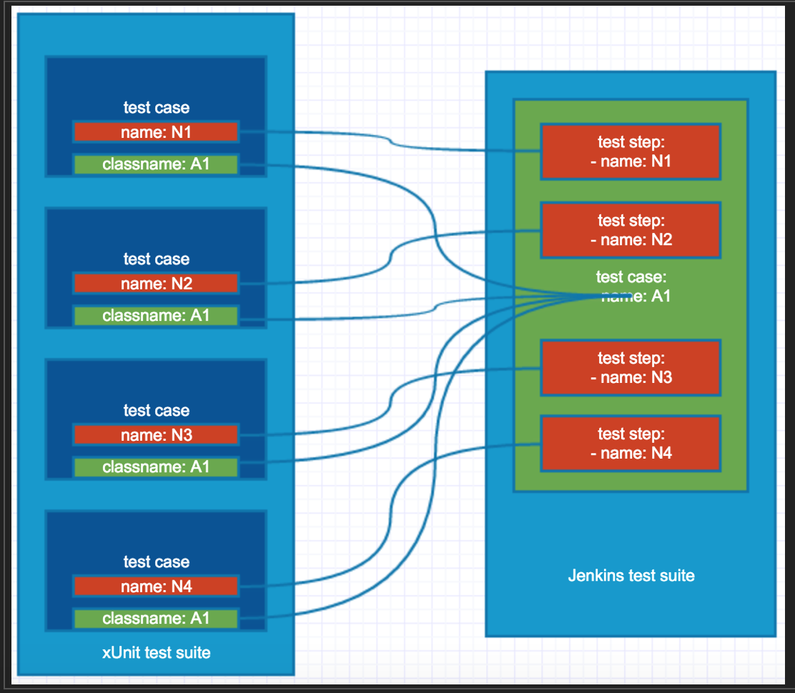

AtlantBH Jenkins plugin: JUnit Results Parser
=======================
  
What is it?
----------------------

A Jenkins post-build plugin used for visual representation of JUnit test results adapted for functional testing.
Test results follow test suite/test case/test step pattern which is easy to understand when writing functional tests. For example: Test suite is smoke test, test case is the name of the smoke test and test steps is the list of steps that will be performed in this test case. One test suite has one or many test cases while one test case has one or many test steps. Conversion from JUnit format to suite/case/step pattern is done automatically in this plugin and then visualized in plugins output in post-build.

What it is not?
----------------------
It is not a viewer of standard Unit tests and is primarily focused on visual representation of functional tests that are written using any framework that supports JUnit (like Selenium, TestNG, Appium...etc.) format.

How it works?
----------------------
Main engine for this plugin is its conversion of standard Unit test scheme into suite/case/step pattern explained above. From the Unit test scheme perspective, following happens:

- Attribute name from testsuite element is mapped to Test Suite Name, along with other useful info like: number of tests, execution time
- All testcase elements which have same classname attribute are one Test Case (classname attribute is test case name)
- All testcase elements which have same classname (part of same Test Case) are Test Steps. Name attribute is test step description. If failure happens, failure attribute represents failure for that specific Test Step. One Test Step can have multiple failures depending on how many assertions failed.

Everything should be clearer when looking at this mapping picture:



Requirements
-----------------------

-	Java 1.6 or greater

-	Maven 3.0 or greater


Build Instructions
-----------------------

-	Go to the top-level directory of the project and run:  
	```
	mvn package
	```
-	'target/*.hpi' file should be generated 


Installation Instructions
-----------------------
	 
-	*.hpi file can be uploaded to Jenkins and installed using the web UI

-	Alternatively, *.hpi file can be added to $JENKINS_HOME/plugins

-	Plugin can be tested by adding 'Publish JUnit test results' post-build action to a job and passing JUnit *.xml file

Usage Instructions
-----------------------

- Go to Specific Job -> Configure -> Add post-build action

- From the dropdown menu, choose Publish JUnit test results

- In File location text box, add absolute path to the location where junit output xml file will be generated by your test suite (for example: ~/mytests/results/output.xml)

- If your suite generates more output xml files, you can add them all in this text box simply by using (,) as delimiter between absolute file locations

- Click on Save button to save job configuration

- When running your job next time, you will have "JUnitParser Results page" link on the left side in your job build execution. Click on that link and you will get visualized representation of your test results

- Visual representation of tests results consists of: Test suite name, General statistics (number of tests, number of succeeded test cases, number of failed test cases, number of skipped test cases, success rate, total execution time), Pie chart which shows visually relation between succeeded, failed test cases and skipped test cases, Test cases list (you can click on specific test case and drop down tree view will open that shows all test steps inside that specific test case)

- You can click on each test step and it will open its details. Success test step is green and it will open execution time for that step while failed test step is red and it will open execution time and list of assertions that failed for that particular test step. Skipped test step is orange and it will open execution for that step.

In summary, this is how it all looks:


Good to know
----------------------
It is very imporant to keep your tests as descriptive as possible. This applies to all situations but in case of using our plugin, it makes sense even more. The more descriptive you are when writing functional tests through JUnit framework, the more benefit you will see in this results reporter plugin. 

Licensing and legal issues
-----------------------
Copyright 2016 AtlantBH, [MIT License] (http://opensource.org/licenses/MIT)
  
  
